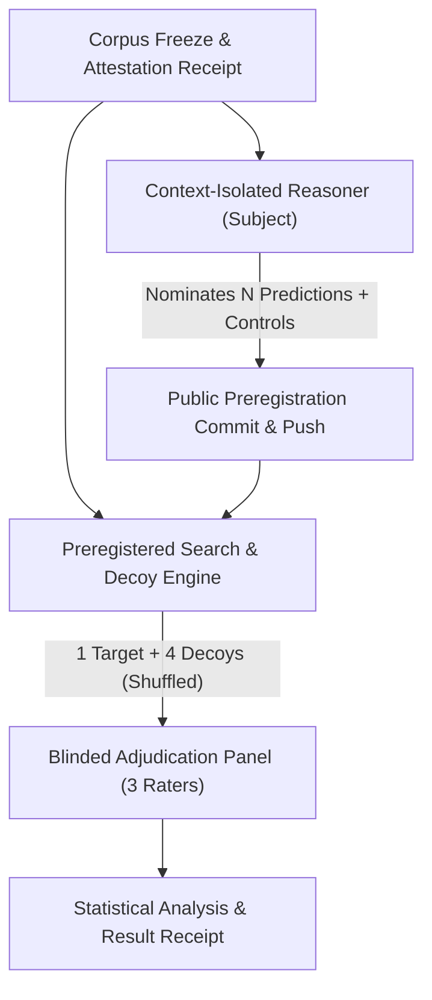

# Preregistered Context-Isolated Generative Correspondence Test Protocol (Crucible Level 3)

## 1. Experimental Purpose

This protocol specifies the experimental procedure for testing whether structural boundary problems nominated by a context-isolated reasoner inspecting ONLY the 11 $CC$ axioms (`CC-1` through `CC-11`) exhibit non-trivial, statistically distinguishable correspondence with downstream entries in a pre-existing, frozen specification corpus.

$$\boxed{\text{Hypothesis: } \mathbb{P}\left(\text{Blind Match} \mid \text{C}_1\text{ Nominated}\right) > \mathbb{P}\left(\text{Blind Match} \mid \text{Control Nominated}\right)}$$

---

## 2. Experimental Roles & Isolation Boundary

### A. Corpus Freeze Gate (T0)
- Before prediction generation begins, the target specification repository commit SHA (`<SPEC_COMMIT_SHA>`) is recorded, working tree verified `CLEAN`, and the corpus SHA-256 digest computed across all Markdown files.
- The total non-CC matrix entry count $N_{\text{corpus}}$ is dynamically derived from the pinned commit.

### B. Subject Reasoner (Context-Isolated)
- **Permitted Context:** The literal text of the 11 $CC$ entries (`CC-1` through `CC-11`) extracted from the pinned corpus commit.
- **Excluded Context:** `MANIFESTO.md`, `crucibles/`, non-CC matrix derivation files (`CL` through `II`), chat transcripts, prior reviewer logs, or training context from post-release dates.
- **Task:** Nominate $N$ predicted boundary tension scenarios (and $M$ control predictions generated from shuffled/unrelated principles).

### C. Preregistration & Immutable Timestamp Gate (T1)
- Predictions are saved to `test-vectors/preregistration/preregistered_predictions_<timestamp>.json`.
- The preregistration file is committed, tagged, and pushed publicly to GitHub before any corpus search or candidate extraction is initiated:
  $$\text{Commit SHA: } H(\text{Preregistration}) \quad \text{pushed to public remote}$$

---

## 3. Candidate Retrieval & Decoy Shuffling Engine

For each preregistered prediction:

1. **Preregistered Search Strategy:** Execute a frozen, non-adaptive retrieval algorithm (fixed embedding model, predefined top-$k$ keyword queries). Zero adaptive retries are permitted based on candidate quality.
2. **Decoy Extraction:** Retrieve 1 primary candidate match + 4 plausible decoy entries from unrelated matrix cells in the pinned corpus.
3. **Lock #0 Literal Extraction:** Extract untouched literal source paragraphs directly from `git show <SPEC_COMMIT_SHA>:<file>`.
4. **Blinded Shuffling:** Shuffle the 5 literal text passages ($P_1, P_2, P_3, P_4, P_5$) so that evaluators cannot determine which passage was retrieved as the intended match.

---

## 4. Blinded Multi-Rater Adjudication

Three independent evaluators (blinded to which passage is the primary candidate match) score every passage against the prediction using operationalized criteria:

- **DIRECT (3 pts):** The literal source text explicitly states the predicted operational mechanism or paradox predicate.
- **STRUCTURALLY RELATED (2 pts):** The literal text defines the substrate or geometric constraint required for the mechanism, but does not explicitly state the predicted scenario.
- **WEAK / INDIRECT (1 pt):** Tenuous or tangential semantic overlap.
- **NONE (0 pts):** No meaningful structural or semantic relationship.

---

## 5. Statistical Endpoint & Negative Controls

- **Control Predictions:** Compare average rating scores of $C_1$-derived predictions against control predictions derived from shuffled or unrelated principle sets.
- **Decoy Discrimination Rate:** Measure whether the primary candidate match scores significantly higher than the 4 shuffled decoys ($p < 0.05$).

---

## 6. What This Protocol Establishes

This protocol is designed to test whether boundary problems nominated from an isolated view of `CC-1` through `CC-11` exhibit nontrivial correspondence with a pre-existing, frozen downstream derivation corpus.

Predictions are frozen before corpus inspection. The specification corpus is independently frozen and attested. Retrieval and grading procedures are preregistered. Misses are preserved, corpus modification is prohibited during the experiment, and correspondence ratings are bound to literal tagged source text.

A successful result would constitute evidence of **generative correspondence** between the constitutional surface and downstream derivation. The strength of that evidence depends on comparison against preregistered controls, independent adjudication, and observed false-positive rates. It would not by itself establish completeness, uniqueness, or ontological truth.
